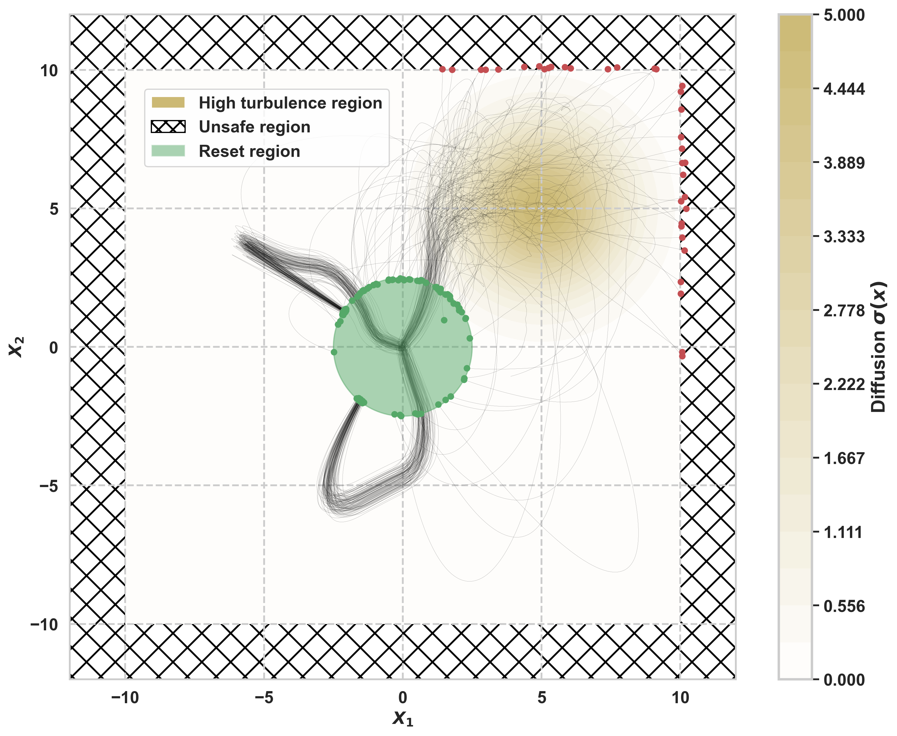

# Safe Learning of Controlled Stochastic Dynamical Systems


[](https://codecov.io/gh/lmotte/dynamics-safe-learn)

This repository implements a kernel‐based method for safely learning the dynamics of controlled stochastic systems. By
iteratively expanding an initial safe control set and leveraging kernel-based confidence bounds, the approach ensures
that each selected control generates trajectories within predefined safety boundaries. This allows the system to operate
safely, even under uncertainty, while accurately estimating its dynamics. This method is particularly relevant
to safety-critical scenarios, including autonomous robotics and biomedical contexts, where
ensuring safety during learning is crucial.

The repository includes implementations for:

- Simulating trajectories.
- Safely generating candidate control functions.
- Kernel-based estimation of dynamical systems.
- Visualization of simulation results and safety performance metrics.

## Overview

The repository is organized into several key components.

### 1. Second-Order Systems Simulation and Visualization

- **1D Systems:** Simulate one-dimensional second-order systems driven by sinusoidal control functions. Generate multiple
  control functions with randomly selected frequency factors, simulate trajectories using Euler–Maruyama integration, and visualize
  control functions, positions, and velocities.

- **2D Systems:** Simulate two-dimensional second-order systems under various control functions. Aggregate the resulting
  trajectories
  into cumulative plots that capture the system's overall behavior.

### 2. Safe Learning Method

- **SafeSDE Model:** A kernel-based estimator (using a Gaussian/RBF kernel by default) that safely estimates the
  probability density of controlled stochastic systems.

### 3. Safe Learning Experiments

- **Safe Learning Script:** Run safe learning experiments using the SafeSDE model by:
    - Sampling safe candidate controls.
    - Simulating system trajectories.
    - Updating the SafeSDE model.
    - Computing performance metrics such as safety/reset probabilities and information gain.
    - Saving results (metrics, model snapshots, and simulation paths) for further analysis.

### 4. Utility Functions and Plotting

- **Simulation Utilities (`utils/data.py`):**  
  Functions for SDE simulation (Euler–Maruyama method), control function generation (including sinusoidal and
  candidate-based controls), and plotting (1D and 2D trajectories, control evolution, and turbulence heatmaps).
- **Additional Utilities (`utils/utils.py`):**  
  Functions for candidate control sampling (both local and grid-based), pairwise evaluations, and plotting histograms of
  observed safety/reset probabilities.

## Repository Structure

```text
├── README.md
├── requirements.txt
├── LICENSE
├── tests/
├── paths_plot.png
├── methods/
│ └── safe_sde_estimation.py
├── utils/
│ ├── data.py
│ └── utils.py
└── examples/
    ├── example_1d/
    ├── example_1d.py
    └── example_2d/
        ├── 2d_second_order_plot_trajectories.py
        ├── 2d_second_order_run.py
        └── plots/
```

## Installation

### Requirements

- Python 3.7 or later

**Python Packages:**

- numpy
- matplotlib
- seaborn
- pandas
- scipy
- scikit-learn
- argparse
- tqdm

### Installation

To install:

1. Clone the repository.
   ```bash
   git clone https://github.com/lmotte/dynamics-safe-learn.git
   ```
2. Install the required dependencies (Python 3.x required).
   ```bash
   pip install -r requirements.txt
    ```

## Usage

**1. Trajectory Simulation and Plotting**

- 1D Simulation and Plotting: Run the script to simulate 1D second-order systems with sinusoidal control functions and
  generate corresponding plots:
   ```bash
   python example_1d.py
    ```
- 2D True Trajectories: Aggregate and visualize trajectories from multiple control policies:
  ```bash
   python 2d_second_order_plot_trajectories.py
    ```

<p align="center">

</p>

**2. Safe Learning Experiments**

Run safe learning experiments using the SafeSDE model by specifying command-line parameters for the kernel function,
safety thresholds, and regularization:

```bash
   python 2d_second_order_run.py --kernel_func 2.0 --betas 0.1 --lam 1e-6
   ```

This script will:

- Safely sample candidate control policies.
- Update the SafeSDE model based on simulated trajectories.
- Compute and save performance metrics along with model snapshots and paths data.

**3. Visualization**

Example plots are provided in the plot folders. You can use the plotting utilities in utils/data.py and utils/utils.py
to generate additional visualizations (e.g., turbulence heatmaps, control evolution, histograms of safety metrics).

## Contributing

Contributions are welcome. If you have ideas for improvements or new features, please fork the repository and submit a
pull request. For major changes, consider opening an issue first to discuss your proposed modifications.

## License

This project is licensed under the MIT License - see the [LICENSE](LICENSE) file for details.